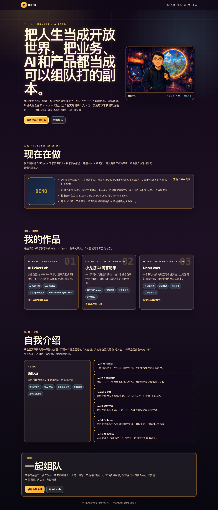
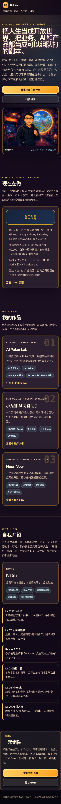

# Bill Xu Personal Homepage

这是 Bill Xu 的个人主页，用来给朋友、合作伙伴和潜在客户快速了解我是谁、现在在做什么、做过哪些有意思的产品实验。

网站用复古游戏和 8-bit 漫画感做视觉包装，把个人经历、AI 咨询方向、产品作品和联系方式组织成一个移动端优先的个人入口。

线上地址：http://150.158.85.220/

## 网站用途

- 展示个人定位：金融科技业务经验、AI 资源连接能力、产品原型能力和游戏化思维。
- 介绍当前方向：围绕 DINQ 做 AI 专家咨询、AI 人才搜索、资源撮合和企业 AI 路线判断。
- 汇总作品入口：AI Poker Lab、小龙虾 AI 问答助手、Neon Vow 互动小说等独立项目。
- 面向朋友和商业合作伙伴，提供一个轻松、有记忆点的个人名片。

## Screenshots

### Desktop



### Mobile



## Features

- Mobile-first responsive layout.
- Chinese / English locale switching based on browser language.
- Retro game themed visual style.
- Optimized WebP comic assets and iOS/PWA icons.
- ICP and public security filing footer.

## Tech Stack

- Vite
- React
- TypeScript
- Vanilla CSS

## Local Development

```bash
npm install
npm run dev
```

## Build

```bash
npm run build
```
